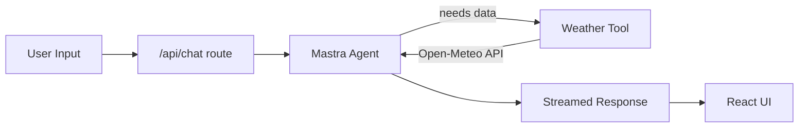

<div align="center">

# 🌤️ Weather Chat

### Mastra + Next.js 16 + AI SDK v7

A minimal, production-shaped starter that wires up a **Mastra agent** with a **custom tool**, streamed into a **Next.js 16** frontend via the **AI SDK v7** `useChat` hook.


</div>

---

## 📋 Table of Contents

- [Overview](#-overview)
- [Prerequisites](#-prerequisites)
- [1. Scaffold Next.js 16](#1️⃣-scaffold-nextjs-16)
- [2. Install Packages](#2️⃣-install-packages)
- [3. Environment Variables](#3️⃣-environment-variables)
- [4. Folder Structure](#4️⃣-folder-structure)
- [5. Create the Weather Tool](#5️⃣-create-the-weather-tool)
- [6. Create the Weather Agent](#6️⃣-create-the-weather-agent)
- [7. Register Mastra](#7️⃣-register-mastra)
- [8. Create the API Route](#8️⃣-create-the-api-route)
- [9. Build the Chat UI](#9️⃣-build-the-chat-ui)
- [10. Run the App](#-run-the-app)
- [Troubleshooting](#-troubleshooting)

---

## 🧭 Overview

This project demonstrates the smallest possible slice of a real agentic app:

| Layer | Responsibility |
|---|---|
| **Mastra Tool** | Fetches live weather data from Open-Meteo |
| **Mastra Agent** | Decides *when* to call the tool and formats the reply |
| **API Route** | Bridges Mastra's agent stream into an AI SDK-compatible stream |
| **Next.js UI** | Renders the conversation with `useChat` |



---

## ✅ Prerequisites

- Node.js **18.18+**
- An **OpenAI API key** (or an OpenAI-compatible provider key)
- Basic familiarity with Next.js App Router

---

## 1️⃣ Scaffold Next.js 16

```bash
npx create-next-app@latest weather-chat --yes --ts --eslint --tailwind --src-dir --app --turbopack --no-react-compiler --no-import-alias
```

```bash
cd weather-chat
```

---

## 2️⃣ Install Packages

```bash
npm install @mastra/core@latest @mastra/ai-sdk@latest @ai-sdk/react@latest @ai-sdk/openai ai@latest zod@latest
```

| Package | Purpose |
|---|---|
| `@mastra/core` | Agent, tool, and orchestration primitives |
| `@mastra/ai-sdk` | Bridges Mastra streams to AI SDK's UI message stream format |
| `@ai-sdk/react` | `useChat` hook for the frontend |
| `@ai-sdk/openai` | OpenAI (or compatible) model provider |
| `ai` | Core AI SDK v7 utilities (`DefaultChatTransport`, stream helpers) |
| `zod` | Schema validation for tool inputs/outputs |

---

## 3️⃣ Environment Variables

Create a `.env` file in the project root:

```bash
OPENAI_API_KEY=sk-...
```

> 💡 Using an OpenAI-compatible router instead? See the [alternate agent config](#option-b-openai-compatible-provider) below and swap in `AGENTROUTER_API_KEY` (or your provider's key) instead.

---

## 4️⃣ Folder Structure

```
src/
├── app/
│   ├── api/
│   │   └── chat/
│   │       └── route.ts
│   └── chat/
│       └── page.tsx
└── mastra/
    ├── agents/
    │   └── weather-agent.ts
    ├── tools/
    │   └── weather-tool.ts
    └── index.ts
```

---

## 5️⃣ Create the Weather Tool

**`src/mastra/tools/weather-tool.ts`**

```ts
import { createTool } from '@mastra/core/tools'
import { z } from 'zod'

export const weatherTool = createTool({
  id: 'get-weather',
  description: 'Get the current weather for a location',
  inputSchema: z.object({
    location: z.string().describe('City name'),
  }),
  outputSchema: z.object({
    location: z.string(),
    temperatureCelsius: z.number(),
    conditions: z.string(),
    humidity: z.number(),
    windKph: z.number(),
  }),
  execute: async ({ location }) => {
    // Geocode the city name
    const geoRes = await fetch(
      `https://geocoding-api.open-meteo.com/v1/search?name=${encodeURIComponent(location)}&count=1`
    )
    const geo = await geoRes.json()

    if (!geo.results?.length) {
      throw new Error(`Location not found: ${location}`)
    }

    const { latitude, longitude, name } = geo.results[0]

    // Fetch current weather
    const weatherRes = await fetch(
      `https://api.open-meteo.com/v1/forecast?latitude=${latitude}&longitude=${longitude}&current=temperature_2m,relative_humidity_2m,wind_speed_10m,weather_code`
    )
    const weather = await weatherRes.json()
    const c = weather.current

    const conditionsMap: Record<number, string> = {
      0: 'Clear sky', 1: 'Mainly clear', 2: 'Partly cloudy', 3: 'Overcast',
      45: 'Fog', 61: 'Light rain', 63: 'Rain', 65: 'Heavy rain',
      71: 'Snow', 80: 'Rain showers', 95: 'Thunderstorm',
    }

    return {
      location: name,
      temperatureCelsius: c.temperature_2m,
      conditions: conditionsMap[c.weather_code] ?? 'Unknown',
      humidity: c.relative_humidity_2m,
      windKph: c.wind_speed_10m,
    }
  },
})
```

---

## 6️⃣ Create the Weather Agent

**`src/mastra/agents/weather-agent.ts`**

Choose **one** of the two options below depending on your provider.

### Option A: Official OpenAI API

```ts
import { openai } from "@ai-sdk/openai";
import { Agent } from "@mastra/core/agent";

import { weatherTool } from "../tools/weather-tool";

export const weatherAgent = new Agent({
  id: "weatherAgent",
  name: "Weather Agent",
  instructions: `
You are a helpful weather assistant.

IMPORTANT RULES:
1. Only use the get-weather tool when the user is actually asking for weather information.
2. For greetings, casual conversation, thanks, or unrelated questions:
   - Do NOT use the weather tool.
   - Respond normally.
3. If the user asks about weather but does not provide a location:
   - Do NOT use the weather tool.
   - Ask for the location.
4. If the user provides a location and asks for weather:
   - Call the get-weather tool.
   - Use the returned data to answer.
   - Never invent weather information.
5. After receiving weather data:
   - Give one concise answer.
   - Do not call the weather tool again for the same request.
6. Include temperature, conditions, humidity, and wind speed.

Keep responses concise and friendly.
`,
  model: openai("gpt-5.6-sol"),
  tools: {
    weatherTool,
  },
});
```

### Option B: OpenAI-Compatible Provider

```ts
import { Agent } from "@mastra/core/agent";
import { createOpenAI } from "@ai-sdk/openai";

import { weatherTool } from "../tools/weather-tool";

const agentRouter = createOpenAI({
  baseURL: "https://agentrouter.org/v1",
  apiKey: process.env.AGENTROUTER_API_KEY,
});

export const weatherAgent = new Agent({
  id: "weatherAgent",
  name: "Weather Agent",
  instructions: `
You are a helpful weather assistant.

IMPORTANT RULES:
1. Only use the get-weather tool when the user is actually asking for weather information.
2. For greetings, casual conversation, thanks, or unrelated questions:
   - Do NOT use the weather tool.
   - Respond normally.
3. If the user asks about weather but does not provide a location:
   - Do NOT use the weather tool.
   - Ask for the location.
4. If the user provides a location and asks for weather:
   - Call the get-weather tool.
   - Use the returned data to answer.
   - Never invent weather information.
5. After receiving weather data:
   - Give one concise answer.
   - Do not call the weather tool again for the same request.
6. Include temperature, conditions, humidity, and wind speed.

Keep responses concise and friendly.
`,
  model: agentRouter("deepseek-v4-flash"),
  tools: { weatherTool },
});
```

> ⚠️ Remember to update your `.env` file to match whichever key your chosen option references (`OPENAI_API_KEY` or `AGENTROUTER_API_KEY`).

---

## 7️⃣ Register Mastra

**`src/mastra/index.ts`**

```ts
import { Mastra } from "@mastra/core/mastra";

import { weatherAgent } from "./agents/weather-agent";

export const mastra = new Mastra({
  agents: {
    weatherAgent,
  },
});
```

---

## 8️⃣ Create the API Route

**`src/app/api/chat/route.ts`**

```ts
import { handleChatStream } from "@mastra/ai-sdk";
import { createUIMessageStreamResponse } from "ai";
import { NextRequest } from "next/server";

import { mastra } from "@/mastra";

export async function POST(req: NextRequest) {
  const params = await req.json();

  const stream = await handleChatStream({
    mastra,
    agentId: "weatherAgent",
    version: "v7",
    params,
  });

  return createUIMessageStreamResponse({
    stream,
  });
}
```

---

## 9️⃣ Build the Chat UI

**`src/app/chat/page.tsx`**

```tsx
"use client";

import { useChat } from "@ai-sdk/react";
import { DefaultChatTransport } from "ai";
import { useState } from "react";

export default function Chat() {
  const [input, setInput] = useState("");

  const { messages, sendMessage, status } = useChat({
    transport: new DefaultChatTransport({
      api: "/api/chat",
    }),
  });

  const isLoading = status === "submitted" || status === "streaming";

  async function handleSubmit(e: React.FormEvent<HTMLFormElement>) {
    e.preventDefault();

    if (!input.trim() || isLoading) return;

    await sendMessage({
      text: input,
    });

    setInput("");
  }

  return (
    <main className="mx-auto flex min-h-screen max-w-2xl flex-col p-6">
      <h1 className="mb-6 text-3xl font-bold">🌤️ Weather Agent</h1>

      <div className="flex-1 space-y-4">
        {messages.map((message) => (
          <div key={message.id}>
            <strong>{message.role === "user" ? "You" : "Agent"}:</strong>

            <div className="mt-1 whitespace-pre-wrap">
              {message.parts.map((part, index) => {
                if (part.type === "text") {
                  return <span key={index}>{part.text}</span>;
                }

                return null;
              })}
            </div>
          </div>
        ))}
      </div>

      <form onSubmit={handleSubmit} className="mt-6 flex gap-2">
        <input
          value={input}
          onChange={(e) => setInput(e.target.value)}
          placeholder="Ask about the weather..."
          className="flex-1 rounded border px-4 py-2"
        />

        <button
          type="submit"
          disabled={isLoading}
          className="rounded bg-black px-4 py-2 text-white disabled:opacity-50"
        >
          {isLoading ? "Thinking..." : "Send"}
        </button>
      </form>
    </main>
  );
}
```

---

## 🚀 Run the App

```bash
npm run dev
```

Then open:

```
http://localhost:3000/chat
```

### Optional: Mastra Studio

For a visual playground to inspect and test your agents directly, run in a **second terminal**:

```bash
npx mastra dev
```

Studio will be available at:

```
http://localhost:4111
```

---

## 🛠 Troubleshooting

<details>
<summary><strong>Location not found errors</strong></summary>

The weather tool relies on Open-Meteo's geocoding API. Try a more specific or differently spelled city name (e.g. `"New York"` instead of `"NYC"`).

</details>

<details>
<summary><strong>Agent never calls the tool</strong></summary>

Double-check your `OPENAI_API_KEY` (or provider key) is set correctly in `.env` and that the dev server was restarted after adding it.

</details>

<details>
<summary><strong>Stream doesn't render in the UI</strong></summary>

Confirm `version: "v7"` is set in `handleChatStream` — this must match your installed `ai` package's major version.

</details>

---

<div align="center">

Built with ❤ using **Mastra**, **Next.js**, and the **AI SDK**

</div>
